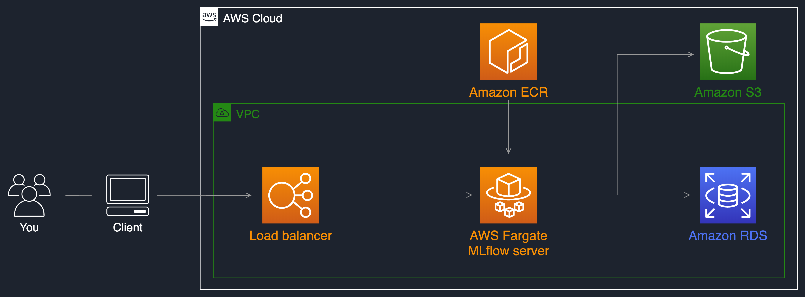
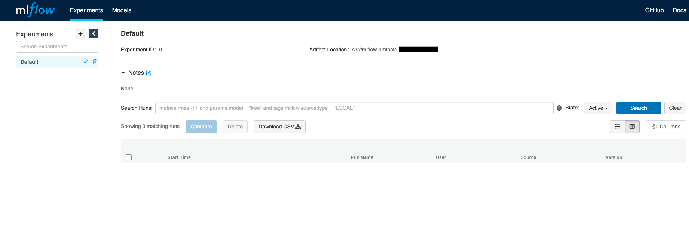

## MLFlow Tracking Server using AWS Fargate


### MLflow tracking server
You can set a central MLflow tracking server during your ML project. By using this remote MLflow server, data scientists
will be able to manage experiments and models in a collaborative manner.
An MLflow tracking server also has two components for storage: a ```backend store``` and an ```artifact store```. This
implementation uses an Amazon S3 bucket as artifact store and an Amazon RDS instance for MySQL as backend store.



### Prerequisites

We will use [the AWS CDK](https://cdkworkshop.com/) to deploy the MLflow server.
Setup local environment with CDK using below command

```
make setup-cdk-local

```

### Deploying the stack

Run following command to deploy and start MLFlow server

```
make deploy-mlops

```

The stack will take a few minutes to launch the MLflow server on AWS Fargate, with an S3 bucket and a MySQL database on
RDS. You can then use the load balancer URI present in the stack outputs to access the MLflow UI:



You now have a remote MLflow tracking server running accessible through
a [REST API](https://mlflow.org/docs/latest/rest-api.html#rest-api) via
the [load balancer uri](https://mlflow.org/docs/latest/quickstart.html#quickstart-logging-to-remote-server). 
You can use the MLflow Tracking API to log parameters, metrics, and models when running your machine learning project.

The following python API command allows you to point your code executing on AWS to your MLflow remote server:

```
import mlflow
mlflow.set_tracking_uri('<YOUR LOAD BALANCER URI>')
```

### Destroying the stack

Run following command to destroy MLFlow stack

```
make destroy-mlops

```
